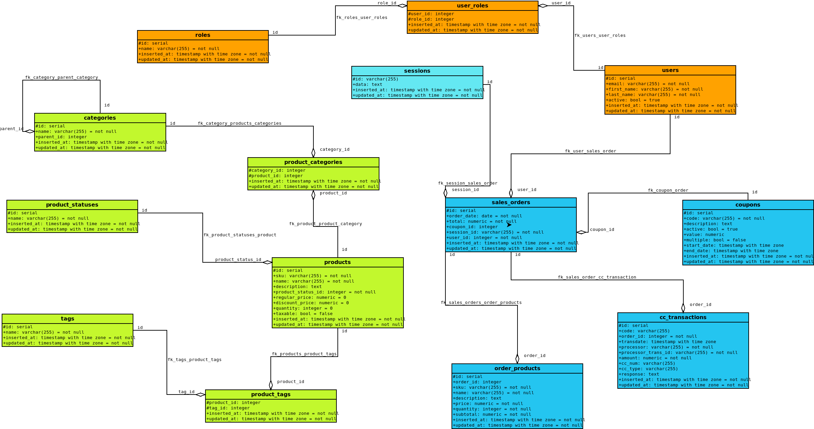

# Hướng dẫn Cài đặt Keycloak

Hướng dẫn này cung cấp hướng dẫn chạy Keycloak ở cả hai môi trường dev và production tại [Docker](https://www.docker.com/).

## Môi trường Dev

Để chạy Keycloak ở môi trường phát triển, bạn có thể sử dụng lệnh sau:

```
docker run --name <tên container> -p 8080:8080 -e KEYCLOAK_ADMIN=<username> -e KEYCLOAK_ADMIN_PASSWORD=<password> quay.io/keycloak/<tên phiên bản> start-dev
```

- Ví dụ cụ thể:

```
docker run --name keycloak -p 8080:8080 -e KEYCLOAK_ADMIN=admin -e KEYCLOAK_ADMIN_PASSWORD=admin quay.io/keycloak/keycloak:25.0.1 start-dev
```

## Môi trường Production

Để chạy Keycloak ở môi trường sản xuất, bạn có thể sử dụng lệnh sau:

```
docker run --name <tên container> -p 8080:8080 -e KEYCLOAK_ADMIN=<username> -e KEYCLOAK_ADMIN_PASSWORD=<password> -v /path/to/cert.pem:/etc/x509/https/tls.crt -v /path/to/key.pem:/etc/x509/https/tls.key quay.io/keycloak/<tên phiên bản>
```

- Ví dụ cụ thể:

```
docker run --name keycloak -p 8080:8080 -e KEYCLOAK_ADMIN=admin -e KEYCLOAK_ADMIN_PASSWORD=admin -v /path/to/cert.pem:/etc/x509/https/tls.crt -v /path/to/key.pem:/etc/x509/https/tls.key quay.io/keycloak/keycloak:25.0.1
```

### Chú ý

- Config keycloak nằm trong file ./Dockerfile
- Thay thế `<tên container>`, `<username>`, `<password>`, `<tên phiên bản>` và đường dẫn `/path/to/cert.pem` và `/path/to/key.pem` bằng các giá trị tương ứng của bạn.
- Đảm bảo rằng các tệp chứng chỉ (cert.pem) và khóa riêng (key.pem) tồn tại ở đường dẫn bạn chỉ định.
- Để biết thêm thông tin chi tiết, bạn có thể tham khảo tài liệu chính thức của [Docker](https://www.docker.com/).

# Tổng quan về Cấu trúc Cơ sở dữ liệu



## Thực thể (Entities)

### Người dùng (Users)

Đại diện cho các người dùng trong hệ thống.

- **id**: UUID, khóa chính.
- **email**: Địa chỉ email duy nhất của người dùng.
- **firstName**: Tên đầu của người dùng.
- **lastName**: Họ của người dùng.
- **active**: Trạng thái hoạt động của người dùng.
- **inserted_at**: Thời điểm tạo người dùng.
- **updated_at**: Thời điểm cập nhật người dùng lần cuối.

### Vai trò (Roles)

Đại diện cho các vai trò mà người dùng có thể có.

- **id**: UUID, khóa chính.
- **name**: Tên của vai trò.
- **inserted_at**: Thời điểm tạo vai trò.
- **updated_at**: Thời điểm cập nhật vai trò lần cuối.

### Liên kết Người dùng - Vai trò (UserRoles)

Mối quan hệ nhiều-nhiều giữa Người dùng và Vai trò.

- **id**: UUID, khóa chính.
- **user_id**: Khóa ngoại tham chiếu đến Người dùng.
- **role_id**: Khóa ngoại tham chiếu đến Vai trò.
- **inserted_at**: Thời điểm tạo liên kết.
- **updated_at**: Thời điểm cập nhật liên kết lần cuối.

### Đơn hàng bán hàng (SalesOrders)

Biểu diễn các đơn hàng trong hệ thống.

- **id**: UUID, khóa chính.
- **order_date**: Ngày đặt hàng.
- **total**: Tổng giá trị đơn hàng.
- **coupon_id**: Khóa ngoại tham chiếu đến Mã giảm giá (nếu có).
- **session_id**: Khóa ngoại tham chiếu đến Phiên làm việc.
- **user_id**: Khóa ngoại tham chiếu đến Người dùng đặt hàng.
- **inserted_at**: Thời điểm tạo đơn hàng.
- **updated_at**: Thời điểm cập nhật đơn hàng lần cuối.

### Phiếu giảm giá (Coupons)

Đại diện cho các phiếu giảm giá có sẵn trong hệ thống.

- **id**: UUID, khóa chính.
- **code**: Mã phiếu giảm giá.
- **description**: Mô tả về phiếu giảm giá.
- **active**: Trạng thái hoạt động của phiếu.
- **value**: Giá trị giảm giá.
- **multiple**: Cho phép sử dụng nhiều lần hay không.
- **start_date**: Ngày bắt đầu hiệu lực của phiếu.
- **end_date**: Ngày kết thúc hiệu lực của phiếu.
- **inserted_at**: Thời điểm tạo phiếu giảm giá.
- **updated_at**: Thời điểm cập nhật phiếu giảm giá lần cuối.

### Giao dịch thẻ tín dụng (CCTransactions)

Biểu diễn các giao dịch thẻ tín dụng liên quan đến đơn hàng.

- **id**: UUID, khóa chính.
- **code**: Mã giao dịch.
- **order_id**: Khóa ngoại tham chiếu đến Đơn hàng bán hàng.
- **transdate**: Thời gian giao dịch.
- **processor**: Nhà cung cấp xử lý giao dịch.
- **processor_trans_id**: Mã giao dịch từ nhà cung cấp.
- **amount**: Số tiền giao dịch.
- **cc_num**: Số thẻ tín dụng (nếu được lưu trữ).
- **cc_type**: Loại thẻ tín dụng (nếu được lưu trữ).
- **response**: Phản hồi từ nhà cung cấp giao dịch.
- **inserted_at**: Thời điểm tạo giao dịch.
- **updated_at**: Thời điểm cập nhật giao dịch lần cuối.

### Sản phẩm trong đơn hàng (OrderProducts)

Biểu diễn các sản phẩm được đặt hàng trong một đơn hàng cụ thể.

- **id**: UUID, khóa chính.
- **order_id**: Khóa ngoại tham chiếu đến Đơn hàng bán hàng.
- **sku**: Mã sản phẩm.
- **name**: Tên sản phẩm.
- **description**: Mô tả sản phẩm.
- **price**: Giá sản phẩm.
- **quantity**: Số lượng sản phẩm.
- **subtotal**: Tổng tiền cho sản phẩm này trong đơn hàng.
- **inserted_at**: Thời điểm thêm sản phẩm vào đơn hàng.
- **updated_at**: Thời điểm cập nhật chi tiết sản phẩm lần cuối.

### Phiên làm việc (Sessions)

Lưu trữ thông tin về phiên làm việc của người dùng.

- **id**: UUID, khóa chính.
- **data**: Dữ liệu của phiên.
- **inserted_at**: Thời điểm tạo phiên.
- **updated_at**: Thời điểm cập nhật phiên lần cuối.

### Sản phẩm (Products)

Đại diện cho các sản phẩm có sẵn để bán trong hệ thống.

- **id**: UUID, khóa chính.
- **sku**: Mã sản phẩm.
- **name**: Tên sản phẩm.
- **description**: Mô tả sản phẩm.
- **product_status_id**: Khóa ngoại tham chiếu đến Trạng thái sản phẩm.
- **regular_price**: Giá bán thường của sản phẩm.
- **discount_price**: Giá bán sau khi giảm giá của sản phẩm.
- **quantity**: Số lượng sản phẩm có sẵn.
- **taxable**: Sản phẩm có chịu thuế hay không.
- **inserted_at**: Thời điểm thêm sản phẩm vào hệ thống.
- **updated_at**: Thời điểm cập nhật thông tin sản phẩm lần cuối.

### Thẻ sản phẩm và Thẻ (ProductTags và Tags)

Đại diện cho các thẻ mô tả sản phẩm và mối quan hệ nhiều-nhiều giữa chúng.

- **ProductTags**: Mối quan hệ nhiều-nhiều giữa Sản phẩm và Thẻ.

  - **product_id**: Khóa ngoại tham chiếu đến Sản phẩm.
  - **tag_id**: Khóa ngoại tham chiếu đến Thẻ.
  - **inserted_at**: Thời điểm tạo liên kết.
  - **updated_at**: Thời điểm cập nhật liên kết lần cuối.

- **Tags**: Đại diện cho các thẻ dùng để phân loại sản phẩm.
  - **id**: UUID, khóa chính.
  - **name**: Tên của thẻ.
  - **inserted_at**: Thời điểm tạo thẻ.
  - **updated_at**: Thời điểm cập nhật thẻ lần cuối.

### Trạng thái sản phẩm (ProductStatuses)

Biểu diễn các trạng thái mà một sản phẩm có thể có (ví dụ: có sẵn, hết hàng).

- **id**: UUID, khóa chính.
- **name**: Tên của trạng thái.
- **inserted_at**: Thời điểm tạo trạng thái.
- **updated_at**: Thời điểm cập nhật trạng thái lần cuối.

### Danh mục sản phẩm và Danh mục (ProductCategories và Categories)

Biểu diễn mối quan hệ giữa các sản phẩm và các danh mục chứa chúng.

- **ProductCategories**: Mối quan hệ nhiều-nhiều giữa Sản phẩm và Danh mục.

  - **product_id**: Khóa ngoại tham chiếu đến Sản phẩm.
  - **category_id**: Khóa ngoại tham chiếu đến Danh mục.
  - **inserted_at**: Thời điểm tạo liên kết.
  - **updated_at**: Thời điểm cập nhật liên kết lần cuối.

- **Categories**: Đại diện cho các danh mục nhóm các sản phẩm.
  - **id**: UUID, khóa chính.
  - **name**: Tên của danh mục.
  - **parent_id**: Khóa ngoại tùy chọn tham chiếu đến danh mục cha.
  - **inserted_at**: Thời điểm tạo danh mục.
  - **updated_at**: Thời điểm cập nhật danh mục lần cuối.

## Mối quan hệ (Relationships)

- **users** <-> **user_roles** <-> **roles**: Mối quan hệ nhiều-nhiều giữa Người dùng và Vai trò.
- **users** <-> **sales_orders**: Mối quan hệ một-nhiều giữa Người dùng và Đơn hàng bán hàng.
- **sessions** <-> **sales_orders**: Mối quan hệ một-một giữa Phiên làm việc và Đơn hàng bán hàng.
- **sales_orders** <-> **coupons**: Mối quan hệ một-nhiều giữa Đơn hàng bán hàng và Phiếu giảm giá.
- **sales_orders** <-> **cc_transactions**: Mối quan hệ một-nhiều giữa Đơn hàng bán hàng và Giao dịch thẻ tín dụng.
- **sales_orders** <-> **order_products**: Mối quan hệ một-nhiều giữa Đơn hàng bán hàng và Sản phẩm trong đơn hàng.
- **products** <-> **product_tags** <-> **tags**: Mối quan hệ nhiều-nhiều giữa Sản phẩm và Thẻ.
- **products** <-> **product_categories** <-> **categories**: Mối quan hệ nhiều-nhiều giữa Sản phẩm và Danh mục.
- **products** <-> **product_statuses**: Mối quan hệ một-một giữa Sản phẩm và Trạng thái sản phẩm.
- **categories** <-> **categories**: Mối quan hệ đệ quy giữa phân loại sản phẩm cha và phân loại sản phẩm con.

```

```
